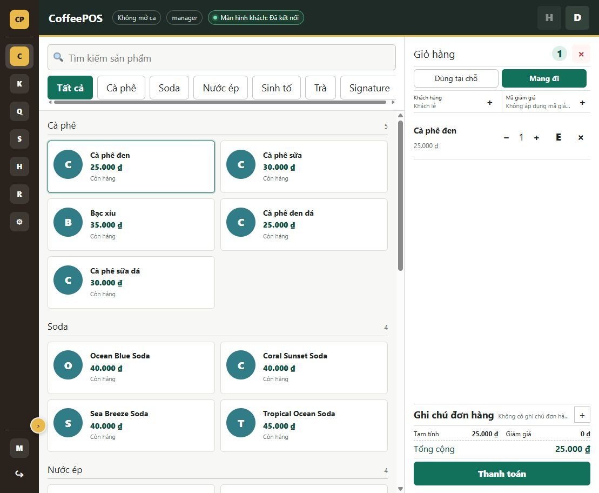
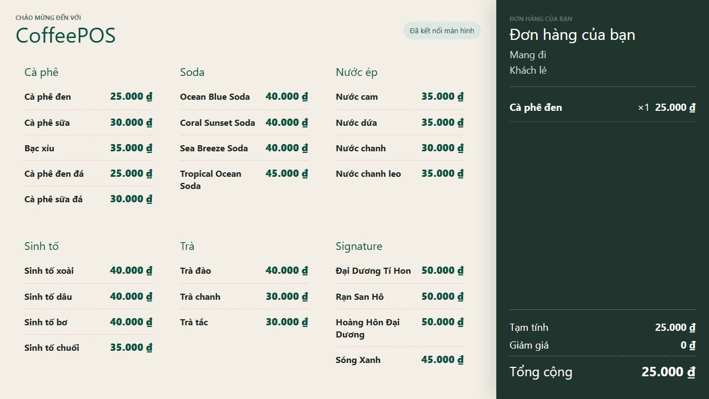
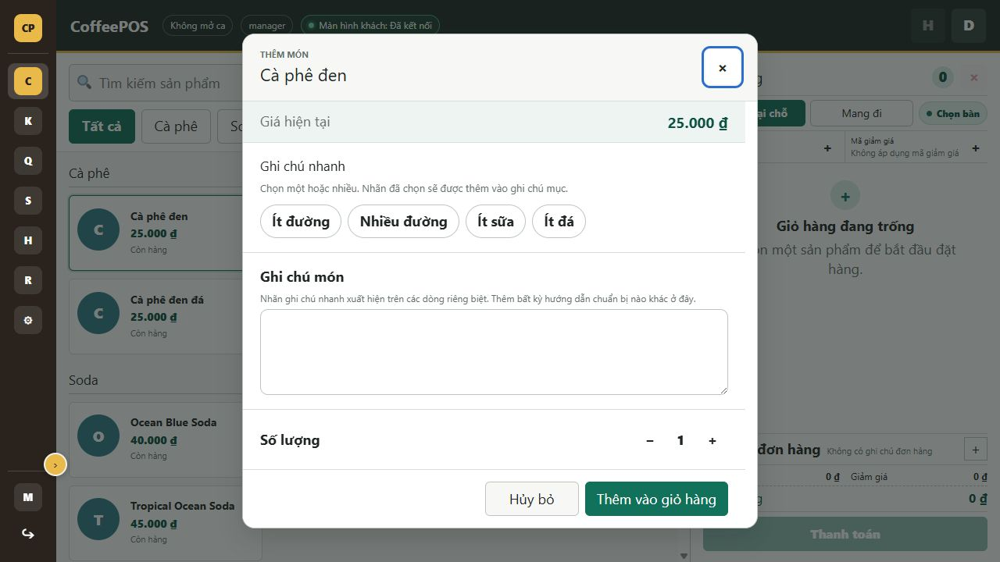
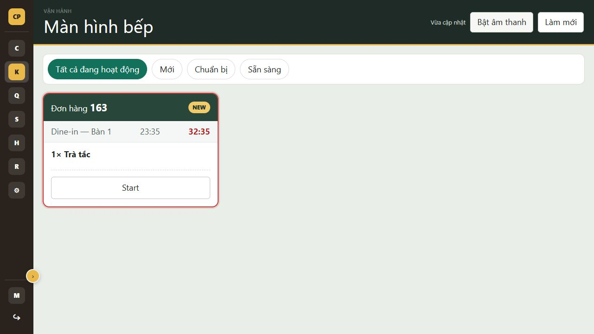
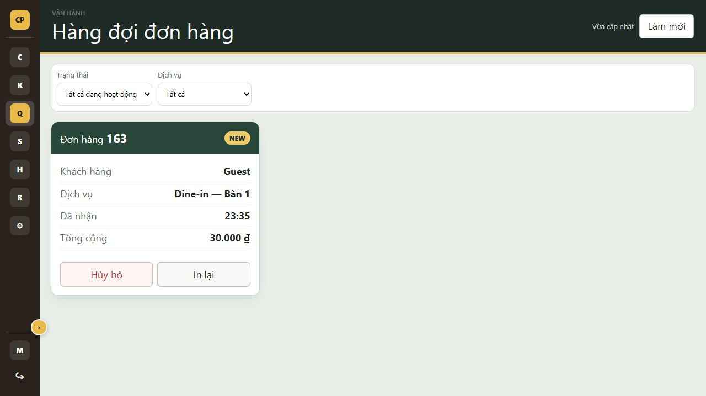
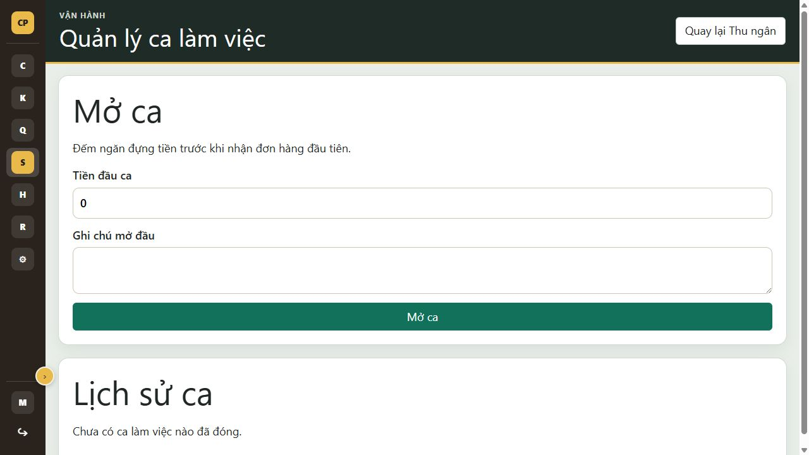
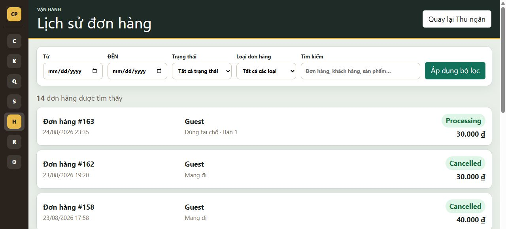
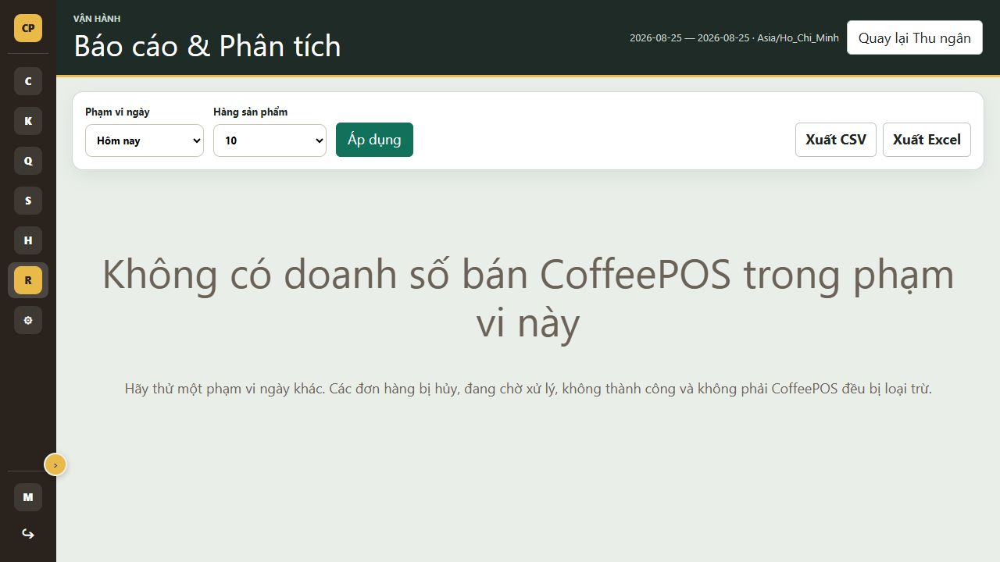
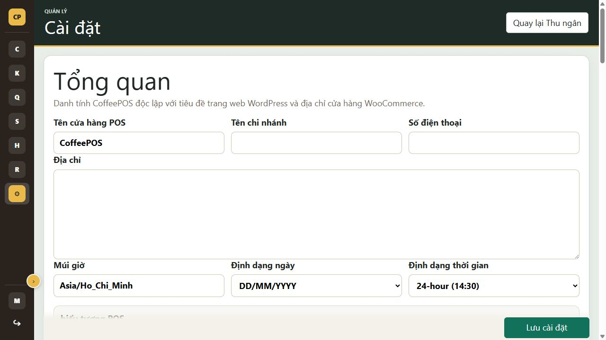

# CoffeePOS

<p align="center">
  <strong>Hệ thống Point of Sale dành cho quán cà phê, vận hành trực tiếp trên WordPress và WooCommerce.</strong>
</p>

<p align="center">
  <a href="https://github.com/thientran2359/coffeepos"></a>
  
  
  
  <a href="LICENSE"></a>
</p>



CoffeePOS biến WooCommerce thành nguồn dữ liệu thương mại trung tâm cho một quy
trình bán hàng tại quầy hoàn chỉnh: thu ngân, màn hình khách hàng, bếp, hàng đợi
đơn hàng, ca làm việc, lịch sử, báo cáo, hội viên và hóa đơn.

Plugin sử dụng giao diện frontend riêng tại `/pos/`. Nhân viên đăng nhập bằng
tài khoản WordPress và chỉ nhìn thấy các màn hình, dữ liệu và thao tác mà
capability của họ cho phép.

> **Trạng thái:** `1.0.0` là bản release candidate. CoffeePOS chưa được mô tả là
> đã phát hành chính thức trên WordPress.org cho đến khi quá trình review và
> kiểm thử production hoàn tất.

## Điểm nổi bật

| | |
|---|---|
| **WooCommerce-native** | Sản phẩm, biến thể, giá, tồn kho, coupon, khách hàng, đơn hàng và refund vẫn thuộc WooCommerce. |
| **Server-authoritative** | Trình duyệt không được quyết định giá, tổng tiền, tồn kho, quyền hoặc trạng thái thanh toán. |
| **Quick stock** | Nhân viên có quyền có thể cập nhật số lượng hoặc trạng thái tồn kho ngay trên product card, kèm lý do bắt buộc. |
| **Hai màn hình tự ghép nối** | Cashier và Customer Display tự tìm nhau trong cùng browser profile, không cần sao chép `pos_session_id`. |
| **Vận hành theo vai trò** | Role và capability riêng cho Cashier, Kitchen, Supervisor và Manager. |
| **Sẵn sàng tiếng Việt** | Có sẵn catalog PHP/JavaScript tiếng Việt và nền tảng WordPress gettext. |
| **Giao diện độc lập** | Tên cửa hàng, logo, màu sắc, mật độ hiển thị và Custom CSS không phụ thuộc WordPress Site Title. |

## Ảnh giao diện

### Cashier và Customer Display

<table>
  <tr>
    <td width="50%"><br><strong>Cashier</strong> — catalog, cart và trạng thái kết nối màn hình khách.</td>
    <td width="50%"><br><strong>Customer Display</strong> — menu và cart đồng bộ theo thời gian thực.</td>
  </tr>
</table>

### Cấu hình món



Popup sản phẩm hỗ trợ số lượng, biến thể khi có, quick notes cấu hình từ
Settings và ghi chú tự do cho từng món.

### Bếp và hàng đợi đơn hàng

<table>
  <tr>
    <td width="50%"><br><strong>Kitchen Display</strong></td>
    <td width="50%"><br><strong>Order Queue</strong></td>
  </tr>
</table>

### Quản lý vận hành

<table>
  <tr>
    <td width="50%"><br><strong>Shift Management</strong></td>
    <td width="50%"><br><strong>Order History</strong></td>
  </tr>
  <tr>
    <td width="50%"><br><strong>Reports & Analytics</strong></td>
    <td width="50%"><br><strong>Frontend Settings</strong></td>
  </tr>
</table>

## Tính năng

### 1. Cashier / POS

- Catalog WooCommerce theo từng category, điều hướng nhanh và tìm kiếm sản phẩm.
- Hiển thị tình trạng còn hàng và giá do WooCommerce cung cấp.
- Hỗ trợ simple product và variable product.
- Popup cấu hình variation, số lượng, quick note và item note.
- Cart có tăng/giảm số lượng, sửa món, xóa món, subtotal, discount và total.
- Cart được lưu server-side, có revision để phát hiện cập nhật cũ/xung đột.
- Dùng tại chỗ hoặc mang đi; dùng tại chỗ có lựa chọn bàn.
- Coupon được kiểm tra và tính lại qua WooCommerce.
- Ghi chú cho cả đơn hàng, tách biệt với ghi chú của từng món.
- Badge báo Customer Display đang kết nối, đang kết nối hoặc mất kết nối.

### 2. Khách hàng và hội viên

- Mặc định bán cho Guest mà không bắt buộc tạo tài khoản.
- Tìm hội viên chính xác bằng số điện thoại.
- Tự điền dữ liệu hội viên đã có trong WooCommerce.
- Cho phép nhân viên được cấp quyền tạo hội viên mới.
- Trả cart về Guest mà không làm mất sản phẩm hoặc service context.
- Customer Display chỉ nhận tên hiển thị và số điện thoại đã che, ví dụ
  `0353***250`; email và số điện thoại đầy đủ không được broadcast.

> Loyalty như mua 5 tặng 1, tích điểm và ưu đãi theo hạng chưa thuộc bản 1.0.0.

### 3. Thanh toán và WooCommerce Order

- Thanh toán tiền mặt với số tiền nhận, kiểm tra trả thiếu và tính tiền thừa.
- Bank Transfer sử dụng VietQR với số tiền và nội dung chuyển khoản từ server.
- QR chỉ xuất hiện trên Customer Display.
- Thu ngân tự kiểm tra ngân hàng và xác nhận đã nhận tiền; VietQR không tự chứng
  minh giao dịch thành công.
- Chỉ tạo WooCommerce order sau khi checkout được xác nhận hợp lệ.
- Order lưu sản phẩm, variation, quick notes, item/order note, service, bàn,
  khách hàng, phương thức thanh toán, cashier và shift context.
- Popup hoàn tất trên Customer Display được giữ đến khi Cashier bắt đầu đơn mới.

### 4. Customer Display

- URL sạch tại `/pos/customer/`, không yêu cầu nhân viên nhập session ID.
- Tự ghép nối với Cashier trong cùng thiết bị, browser profile và WordPress user.
- Nút Display trên Cashier tái sử dụng/reload tab Customer Display đã mở.
- BroadcastChannel riêng theo cart sau khi ghép nối, có revision và snapshot
  recovery khi display mở muộn hoặc bỏ lỡ message.
- Hiển thị menu, cart, khách Guest/Member, subtotal, discount và total.
- Hiển thị hướng dẫn tiền mặt hoặc VietQR trong bước thanh toán.
- Hiển thị trạng thái đơn thành công mà không tự suy đoán trạng thái payment.

### 5. Kitchen Display System

- Phát hiện và tải lại các đơn CoffeePOS đang hoạt động.
- Bộ lọc New, Preparing và Ready.
- Hiển thị service/bàn, thời gian nhận, sản phẩm, variation và ghi chú bếp.
- Đồng hồ thời gian chuẩn bị cùng cảnh báo chậm/critical.
- Chuyển trạng thái đơn bằng thao tác nhanh.
- Tùy chọn âm thanh khi có đơn mới và polling interval trong Settings.

### 6. Order Queue

- Lọc đơn theo trạng thái và loại phục vụ.
- Hiển thị khách hàng, service, thời gian nhận và tổng tiền.
- Hoàn tất hoặc hủy đơn theo trạng thái và capability hợp lệ.
- In lại hóa đơn từ projection đáng tin cậy của server.

### 7. Shift Management

- Mở ca với tiền đầu ca và ghi chú.
- Có thể bắt buộc mở ca trước khi checkout.
- Gắn đơn hàng vào đúng ca và nhân viên.
- Tách tổng tiền mặt, chuyển khoản và refund.
- Tính tiền mặt dự kiến, tiền thực tế và chênh lệch khi đóng ca.
- Hiển thị lịch sử ca đã đóng; ca đã đóng không thể mở lại.

### 8. Order History

- Phân trang, tìm kiếm và lọc theo ngày, trạng thái và loại đơn.
- Chi tiết lấy từ WooCommerce order và CoffeePOS context.
- Hủy đơn đang hoạt động khi state machine cho phép.
- Refund thật bằng WooCommerce, không vượt quá refundable balance.
- Quick reorder tạo cart mới bằng giá và tồn kho hiện tại.
- In lại hóa đơn từ dữ liệu order authoritative.

### 9. Reports & Analytics

- Preset hôm nay, hôm qua, 7 ngày, tháng hiện tại hoặc khoảng ngày tùy chọn.
- Orders, products sold, gross revenue, refunds, net revenue và average order
  value được tính ở server.
- Phân tích theo phương thức thanh toán.
- Best sellers theo doanh thu và số lượng.
- Phân tích peak hours theo timezone cửa hàng.
- Export CSV và Excel `.xlsx`; Excel cần PHP Zip extension.
- Không cộng gộp các currency khác nhau.

### 10. Hóa đơn

- In sau checkout và tùy chọn tự động in.
- In lại từ Order Queue hoặc Order History.
- Khổ giấy 58 mm hoặc 80 mm.
- Luôn có items, subtotal, discount, total, payment method, cashier và thời gian.
- Có thể bật in private order note.
- Chặn gọi hộp thoại in nếu receipt projection thiếu hoặc tải thất bại.

### 11. Frontend Settings

Settings nằm tại `/pos/settings/`, không đặt trong WooCommerce Admin:

- **General:** tên POS, chi nhánh, logo, địa chỉ, điện thoại, timezone và format.
- **Appearance:** màu thương hiệu, trạng thái menu trái, mật độ giao diện, ảnh sản
  phẩm và Custom CSS.
- **Sales:** service mặc định, yêu cầu bàn, yêu cầu shift và hành vi sau checkout.
- **Dine-in tables:** mỗi dòng textarea là một bàn.
- **Payments:** Cash, Bank Transfer và thông tin VietQR.
- **Operational screens:** polling KDS/Queue và âm thanh đơn mới.
- **Item quick notes:** label, product/category IDs, thứ tự và enabled.
- **Receipt:** khổ giấy, auto print, order note và footer.
- **Customer & Membership:** bật hội viên, tạo hội viên và trường bắt buộc.

### 12. Đăng nhập và phân quyền

CoffeePOS không sử dụng PIN hoặc session đăng nhập riêng. `/pos/` sử dụng hoàn
toàn WordPress authentication, cookie, nonce và account lifecycle.

Các role mặc định:

| Role | Phạm vi chính |
|---|---|
| CoffeePOS Cashier | Cashier, ca cá nhân, history, reprint và reorder |
| CoffeePOS Kitchen | KDS và Order Queue |
| CoffeePOS Supervisor | Cashier, KDS, Queue, ca, history, reprint, reorder và cancel |
| CoffeePOS Manager | Toàn bộ tính năng, refund, reports và settings |

Administrator và Shop Manager được cấp toàn bộ CoffeePOS capabilities khi
plugin kích hoạt/migrate. Mọi REST route và thao tác nhạy cảm đều kiểm tra
capability cụ thể ở server.

## Kiến trúc và nguyên tắc dữ liệu

```text
POS UI
  → WordPress REST API + nonce/capability
    → CoffeePOS application/domain services
      → WooCommerce CRUD, cart session, customers, coupons and orders
```

- WooCommerce là canonical owner của dữ liệu thương mại.
- Cart đang hoạt động được định danh bằng opaque `pos_session_id` ở nội bộ và có
  revision tăng đơn điệu.
- Client không được gửi giá/tổng tiền để server tin trực tiếp.
- Customer Display chỉ nhận projection giới hạn quyền riêng tư.
- KDS, Queue, History và Reports dùng server projections thay vì sao chép business
  logic trên từng màn hình.
- Plugin không sửa WooCommerce core và không sử dụng frontend framework.

Tài liệu kiến trúc, hợp đồng API và phase planning được duy trì nội bộ, không
phân phối trong public source repository.

## Yêu cầu hệ thống

- WordPress `6.4` trở lên.
- PHP `7.4` trở lên.
- WooCommerce được cài đặt và kích hoạt.
- Trình duyệt hiện đại có `BroadcastChannel` cho Customer Display.
- Cashier và Customer Display hiện cần cùng thiết bị/browser profile.
- PHP Zip extension nếu cần export Excel.
- HTTPS được khuyến nghị cho production.

## Cài đặt

### Cài bằng ZIP

1. Tải `build/coffeepos-1.0.0.zip` hoặc artifact release tương ứng.
2. Trong WordPress mở **Plugins → Add New → Upload Plugin**.
3. Kích hoạt WooCommerce trước, sau đó kích hoạt CoffeePOS.
4. Mở `/pos/` và đăng nhập bằng tài khoản WordPress được cấp quyền.
5. Hoàn thiện cấu hình tại `/pos/settings/`.

### Cài từ source

```bash
cd wp-content/plugins
git clone https://github.com/thientran2359/coffeepos.git
cd coffeepos
composer install --no-dev --optimize-autoloader
```

Sau đó kích hoạt plugin trong WordPress. Repository không yêu cầu JavaScript
build pipeline hoặc frontend package manager.

## Quy trình vận hành cơ bản

1. Manager cấu hình cửa hàng, bàn, payment, receipt và role.
2. Cashier đăng nhập tại `/pos/` và mở ca nếu cửa hàng yêu cầu.
3. Mở `/pos/customer/` một lần trên màn hình hướng về khách.
4. Cashier chọn món, khách hàng, service/bàn, coupon và order note.
5. Chọn Cash hoặc Bank Transfer, kiểm tra đã nhận đủ tiền rồi hoàn tất checkout.
6. Đơn xuất hiện ở KDS và Order Queue.
7. Kitchen cập nhật trạng thái; Queue hoàn tất hoặc in lại hóa đơn.
8. Cuối ca, cashier nhập tiền thực tế và đóng ca; manager xem reports/history.

## VietQR và dịch vụ bên ngoài

Khi Bank Transfer được bật, Customer Display tải ảnh từ
`https://vietqr.app/img`. URL có thể chứa bank ID, account number, account
holder, store name, tổng tiền authoritative và payment reference.

CoffeePOS không coi ảnh QR là bằng chứng thanh toán. Thu ngân phải kiểm tra ngân
hàng và xác nhận đã nhận tiền trước khi tạo order. Xem disclosure đầy đủ trong
[readme.txt](readme.txt).

## Phát triển và kiểm thử

Thay đổi phải giữ tương thích PHP 7.4, Vanilla JavaScript, PHP-owned templates,
WordPress capabilities và WooCommerce ownership boundaries.

Một số kiểm tra chính:

```bash
composer validate --no-check-publish
php tests/Phase01/core_scenarios.php
php tests/Phase12/core_scenarios.php
php tests/Phase13/release_scenarios.php
php tests/Phase13/translation_scenarios.php
node tests/Phase06/protocol_scenarios.js
```

Tạo release ZIP trên Windows:

```powershell
powershell -NoProfile -ExecutionPolicy Bypass -File tools/build-release.ps1
```

## Giới hạn hiện tại và hướng phát triển

- Customer Display realtime hiện chỉ hỗ trợ cùng browser profile/device.
- Bank Transfer cần thu ngân xác nhận thủ công; chưa có webhook xác minh ngân
  hàng.
- Loyalty benefits, mua 5 tặng 1, tier discounts và points chưa triển khai.
- Chưa có driver cho receipt printer, cash drawer, barcode scanner hoặc payment
  terminal chuyên dụng.

Các nhóm tiếp theo dự kiến tập trung vào Production Operations, Loyalty &
Membership Benefits, sau đó Hardware & Payment Integrations. Mọi tính năng mới
vẫn phải giữ WooCommerce làm nguồn dữ liệu canonical.

## License

CoffeePOS được phát hành theo [GPL-2.0-or-later](LICENSE).
